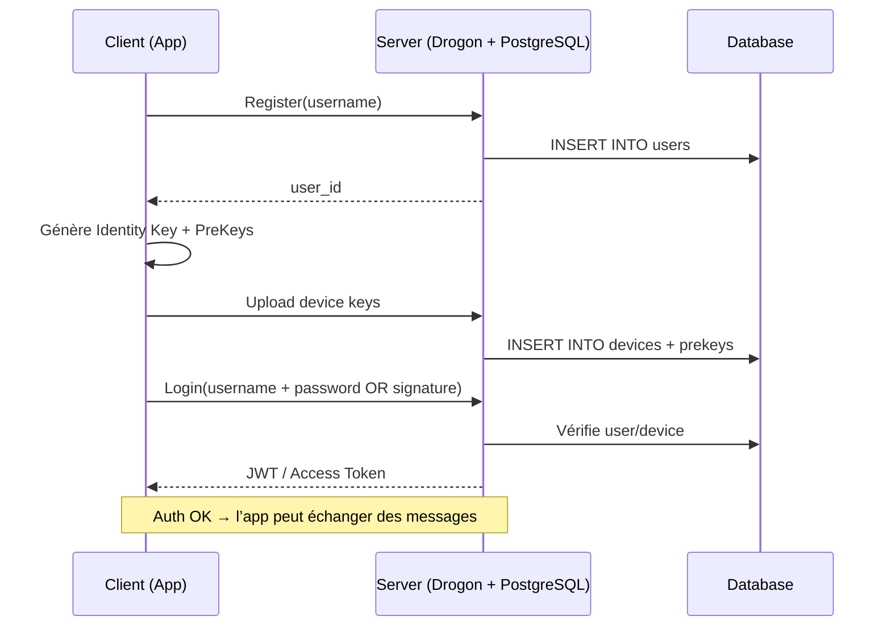
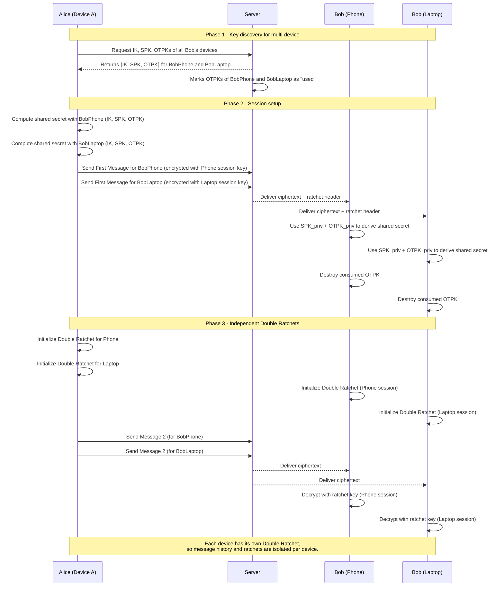

# E2EE Messaging Backend
This is the backend for an end-to-end encrypted messaging application. It is built using the Drogon C++ framework and PostgreSQL for data storage.

## Authentication Flow

## Communication Flow
